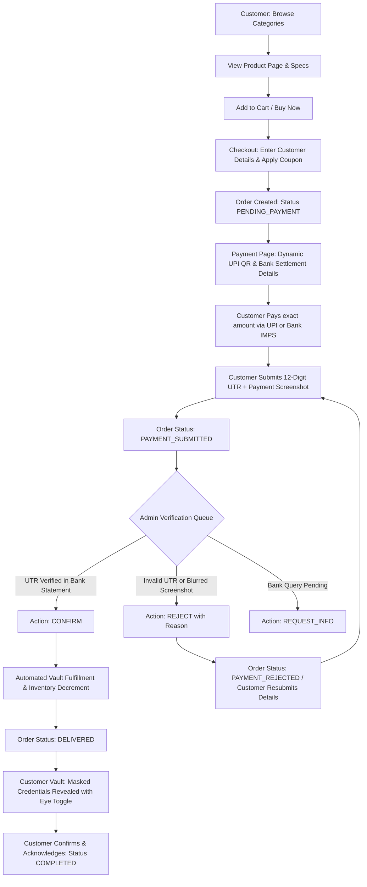

# ValorVault — Digital Gaming & Creator Marketplace

[](http://localhost:5173)
[](http://localhost:5000)
[](http://localhost:5173)

**ValorVault** is a specialized peer-verified digital marketplace for high-tier gaming accounts, in-game currency vouchers, and digital creator assets (Valorant, BGMI, PUBG Mobile, Free Fire, YouTube channels, and more).

Unlike standard e-commerce stores, **ValorVault eliminates credit card chargeback fraud and payment gateway failures by implementing an Indian UPI and Direct Bank Transfer manual escrow verification system**. Customers place an order, transfer the exact amount, submit their 12-digit UTR and payment screenshot, and receive sensitive digital credentials inside an authenticated Digital Vault only after an administrator independently validates the transaction in the bank ledger.

---

## 🚀 Live Servers & Quick Access

- **Vite Interactive Client**: [http://localhost:5173](http://localhost:5173)
- **Unified Express Backend & API**: [http://localhost:5000](http://localhost:5000)
- **Interactive Role Switcher**: Available directly in the top banner to toggle between **Customer View (Aayush Sharma)** and **Admin Portal (Master Admin)** with 1-click.

### Demo Credentials

| Role | Email | Password | Phone |
| :--- | :--- | :--- | :--- |
| **Master Admin** | `admin@valorvault.gg` | `admin123` | `+91 98765 43210` |
| **Verified Customer** | `player@gmail.com` | `player123` | `+91 98112 23344` |

---

## 🎮 Main Marketplace Categories

1. **Valorant**: Radiant / Immortal stacked accounts, smurfs, Kuronami & Champions bundles, 5,350+ VP official prepaid voucher cards.
2. **BGMI**: Glacier M416 Max Level 7 accounts, Poseidon X-Suits, Conqueror titles, 4,450 UC direct character ID top-up.
3. **PUBG Mobile**: Global version accounts, Blood Raven X-Suit 5-Star, Godzilla AWM, Royale Pass packs.
4. **Free Fire**: Max Level 7 Evo Guns, Season 1 Sakura and Season 2 Hip Hop bundles, Diamond vouchers.
5. **YouTube Assets**: 124K & 45K subscriber monetized gaming channels (active YPP, AdSense ready, clean strike records).
6. **Other Games & Social**: Steam keys, GTA V modded accounts, Discord Nitro, and social creator handles.

---

## 🔄 The Complete Customer & Admin Workflow



---

## 🛡️ Order State Machine

The order lifecycle adheres strictly to the specification:

- `PENDING_PAYMENT`: Order generated; waiting for customer payment.
- `PAYMENT_SUBMITTED`: UTR reference and screenshot uploaded.
- `PAYMENT_UNDER_REVIEW`: Flagged for manual bank inquiry.
- `PAYMENT_CONFIRMED`: Admin independently matched the UTR in bank records.
- `PROCESSING`: Preparing delivery payload.
- `READY_FOR_DELIVERY`: Vault item staged.
- `DELIVERED`: Credentials unlocked in authenticated customer vault.
- `COMPLETED`: Customer confirmed full access.
- `PAYMENT_REJECTED`: Rejection reason published; customer can resubmit without losing order.
- `RESUBMISSION`: Corrected UTR/screenshot re-evaluated with full history preserved.
- `REFUND_REQUESTED`: Customer submitted refund ticket.
- `REFUNDED`: Admin approved refund.
- `DISPUTED`: In review with customer desk.

---

## 📦 Key System Features

### 1. Customer Storefront
- **Responsive Dark Cyberpunk UI**: Built with Valorant crimson (`#ff4655`), electric cyan (`#00f5d4`), and glassmorphism.
- **Dynamic Search & Filtering**: Multi-criteria filters by Category, Delivery Method, Rank/MMR, Price Range, In-Stock, and Hot Deals.
- **Product Card Security**: Public cards display specifications, pricing, and availability **without exposing sensitive credentials**.
- **Comprehensive Product Page**: Image gallery, detailed specifications, "What's Included", Delivery information, Terms, Refund Policy, and Verified Customer Reviews.
- **Coupon Engine**: Validates codes (e.g., `VALOR10` for 10% off, `VAULT500` for ₹500 off, `FIRST50`), minimum order values, and category restrictions.

### 2. Manual Payment Gateway
- **Dynamic UPI QR Code**: Uses `qrcode.react` to generate standardized `upi://pay?pa=...&pn=...&am=...&cu=INR` QR codes matching the exact order total.
- **One-Click Copy Buttons**: Instant clipboard copying with feedback for UPI ID (`valorvault@okaxis`), Bank Account Number, IFSC, and Payee Name.
- **Proof Submission**: Validates 12-digit UTR and allows drag-and-drop screenshot uploads with instant local preview.

### 3. Admin Command Center
- **Payment Verification Queue**: Lists orders awaiting reconciliation with customer name, phone, expected amount, UTR, and click-to-zoom screenshot inspector.
- **One-Click Verification**: 
  - `Confirm Payment` automatically binds an unallocated asset from `inventory_vault`, sets status to `DELIVERED`, and decrements catalog stock.
  - `Reject Payment` triggers a modal requiring a rejection reason that notifies the customer.
- **Deliveries Management & Manual Override**: Allows admin to input custom account credentials or fulfillment references.
- **Products & Inventory Vault**: Full CRUD for catalog items and secure vault allocations.
- **Coupon Management**: Create percentage or flat discounts with usage limits and expiry dates.
- **Support Helpdesk**: Filter customer tickets by issue type (`payment_problem`, `delivery_issue`, `account_issue`, `refund_request`, etc.) and send official admin replies.
- **Payment Configuration Settings**: Edit UPI VPA, Bank Account details, and Notice banners in real time.
- **Immutable Security Audit Trail**: Logs timestamp, actor, role, entity, and action for every sensitive payment, delivery, and refund transition.

---

## 🗄️ Database Structure (`server/valorvault.db`)

SQLite database with WAL mode and foreign key integrity:
- `users`: `id`, `name`, `email`, `phone`, `role`, `password`, `avatar`, `created_at`
- `categories`: `id`, `name`, `slug`, `icon`, `description`, `badge`, `display_order`
- `products`: `id`, `category_id`, `name`, `slug`, `price`, `original_price`, `stock`, `delivery_type`, `images`, `specs`, `whats_included`, `terms`, `refund_policy`, `status`
- `inventory_vault`: `id`, `product_id`, `item_type`, `secret_data`, `is_allocated`, `allocated_to_order_id`, `allocated_at`
- `orders`: `id`, `order_number`, `user_id`, `customer_name`, `customer_email`, `customer_phone`, `total_amount`, `status`, `payment_status`, `payment_method`, `rejection_reason`
- `order_items`: `id`, `order_id`, `product_id`, `product_name`, `price`, `quantity`, `delivery_type`, `specs_snapshot`
- `payments`: `id`, `order_id`, `method`, `amount`, `utr`, `screenshot_url`, `status`, `rejection_reason`, `verified_by`, `verified_at`
- `payment_attempts`: `id`, `order_id`, `attempt_number`, `method`, `amount`, `utr`, `screenshot_url`, `status`, `rejection_reason`
- `deliveries`: `id`, `order_id`, `delivery_type`, `delivery_data`, `status`, `delivered_at`, `delivered_by`, `customer_acknowledged_at`
- `support_tickets`: `id`, `ticket_number`, `user_id`, `customer_name`, `customer_email`, `order_id`, `issue_type`, `subject`, `message`, `status`, `admin_reply`
- `coupons`: `id`, `code`, `discount_type`, `discount_value`, `min_order_value`, `max_uses`, `uses_count`, `expiry_date`, `is_active`
- `reviews`: `id`, `product_id`, `customer_name`, `rating`, `comment`, `verified_purchase`
- `audit_logs`: `id`, `entity_type`, `entity_id`, `action`, `actor_name`, `actor_role`, `details`, `created_at`
- `settings`: `key`, `value`, `description`, `updated_at`

---

## 🛠️ Project Execution & Commands

```bash
# Start backend server
node server/server.js

# Start frontend dev server
npm --prefix client run dev

# Or run both concurrently
npm run dev

# Run automated end-to-end integration test
node test-workflow.js
```
